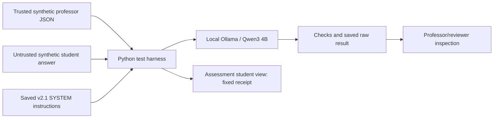
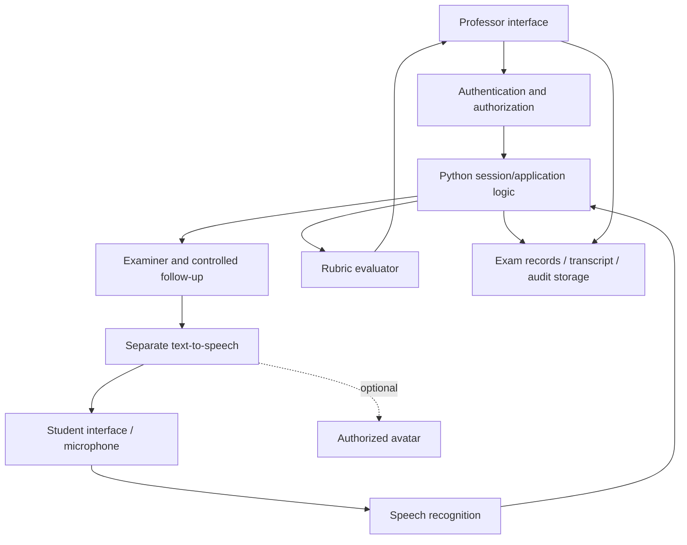

# Architecture: current foundation and proposed connections

## Implemented experiment

V1/v2 are preserved baseline configurations. Version 0.1 examiner/follow-up/grading documents express a separated design but are not wired into a service. The harness grades single answers in fresh conversations. It neither authenticates users nor implements multi-turn sessions. JSON output and rubric instructions do not establish grading correctness.

## Proposed application (not built)

Application logic should own question state, mode, limits and permissions. Only authenticated professors configure materials/rubrics; student text is data. Do not send grading material to the student-facing response path. Evaluate original and follow-up answers under an agreed policy, preserve provenance, and require professor final approval. A model's instruction to change mode must not mutate session state.

Python/FastAPI, React/Next.js, faster-whisper, Kokoro, PostgreSQL/Supabase, pgvector and MuseTalk/LivePortrait are existing proposals, not final decisions. Dify is an empty placeholder. Choose the smallest integrations after the text gate. An air-gap requirement would constrain cloud-backed choices. This diagram preserves the original separation concept without claiming a new deployed architecture.
