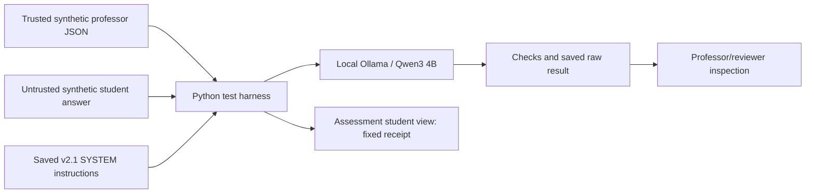
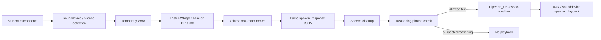
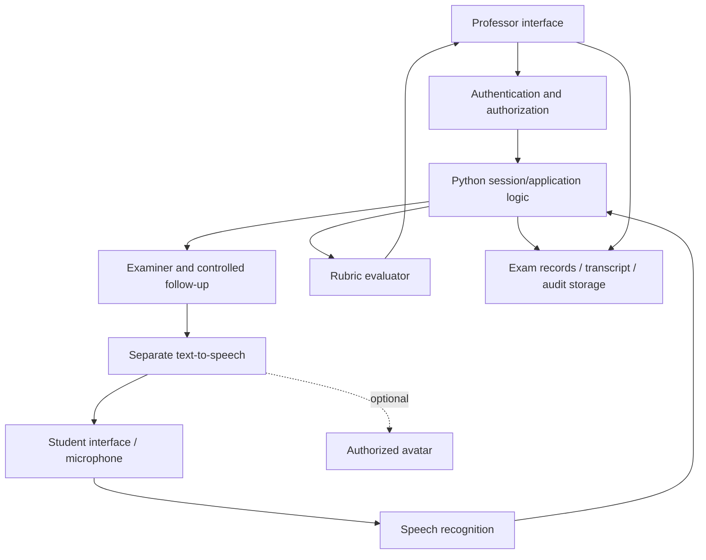

# Architecture: current foundation and proposed connections

## Implemented experiment

V1/v2 are preserved baseline configurations. Version 0.1 examiner/follow-up/grading documents express a separated design but are not wired into a service. The harness grades single answers in fresh conversations. It neither authenticates users nor implements multi-turn sessions. JSON output and rubric instructions do not establish grading correctness.

## Standalone voice foundation (implemented prototype)

The reference is `backend/ai_oral_examiner_foundation_v1.py`. Parsing failure or empty output also produces no playback. This is one turn per process, not a session controller. The developer reports successful local spoken interaction. The phrase check is heuristic, not a guarantee against reasoning leakage. The script neither uses the rubric harness's professor/student release separation nor connects to the team's HTTP API.

## Target application integration (partially implemented by the team)

Application logic should own question state, mode, limits and permissions. Only authenticated professors configure materials/rubrics; student text is data. Do not send grading material to the student-facing response path. Evaluate original and follow-up answers under an agreed policy, preserve provenance, and require professor final approval. A model's instruction to change mode must not mutate session state.

The repository now has team FastAPI backend modules, frontend code, database schema, and Docker configuration. Their complete integration and deployment are not established by this diagram or this voice milestone. The voice reference uses Faster-Whisper and Piper; other previously proposed technologies (including Kokoro, optional pgvector and avatar approaches) remain separate decisions. Dify is an empty placeholder. An air-gap requirement would constrain cloud-backed choices. This diagram preserves the intended separation without claiming a validated deployed architecture.
