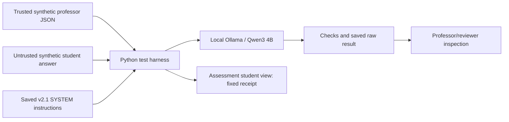
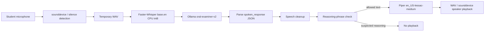
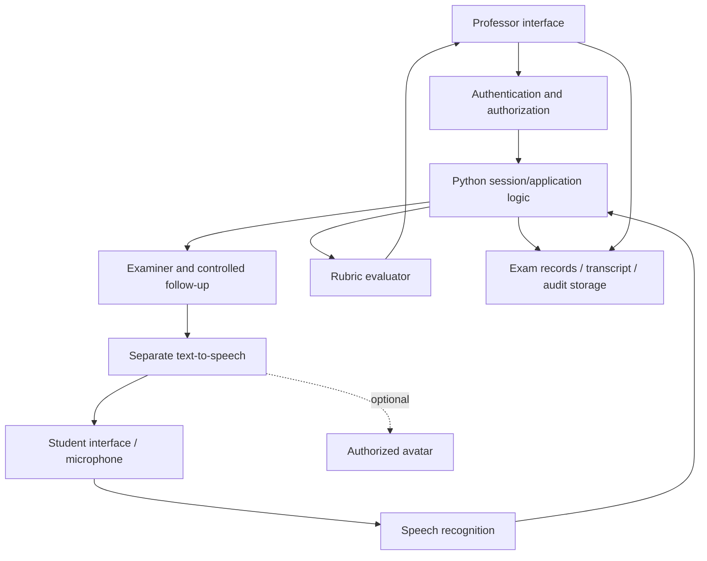
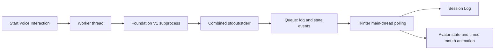

# Architecture: current foundation and proposed connections

## Implemented experiment

```mermaid
flowchart LR
 P[Trusted synthetic professor JSON] --> H[Python test harness]
 S[Untrusted synthetic student answer] --> H
 M[Saved v2.1 SYSTEM instructions] --> H
 H --> O[Local Ollama / Qwen3 4B]
 O --> V[Checks and saved raw result]
 V --> R[Professor/reviewer inspection]
 H --> A[Assessment student view: fixed receipt]
```

V1/v2 are preserved baseline configurations. Version 0.1 examiner/follow-up/grading documents express a separated design but are not wired into a service. The harness grades single answers in fresh conversations. It neither authenticates users nor implements multi-turn sessions. JSON output and rubric instructions do not establish grading correctness.

## Standalone voice foundation (implemented prototype)

```mermaid
flowchart LR
 S[Student microphone] --> R[sounddevice / silence detection]
 R --> W[Temporary WAV]
 W --> STT[Faster-Whisper base.en CPU int8]
 STT --> O[Ollama oral-examiner-v2]
 O --> J[Parse spoken_response JSON]
 J --> C[Speech cleanup]
 C --> F[Reasoning-phrase check]
 F -->|allowed text| P[Piper en_US-lessac-medium]
 P --> A[WAV / sounddevice speaker playback]
 F -->|suspected reasoning| B[No playback]
```

The reference is `backend/ai_oral_examiner_foundation_v1.py`. Parsing failure or empty output also produces no playback. This is one turn per process, not a session controller. The developer reports successful local spoken interaction. The phrase check is heuristic, not a guarantee against reasoning leakage. The script neither uses the rubric harness's professor/student release separation nor connects to the team's HTTP API.

## Target application integration (partially implemented by the team)

```mermaid
flowchart TD
 PI[Professor interface] --> AUTH[Authentication and authorization]
 AUTH --> APP[Python session/application logic]
 SI[Student interface / microphone] --> STT[Speech recognition]
 STT --> APP
 APP --> EX[Examiner and controlled follow-up]
 EX --> TTS[Separate text-to-speech]
 TTS --> SI
 TTS -. optional .-> AV[Authorized avatar]
 APP --> EV[Rubric evaluator]
 EV --> PI
 APP --> DB[Exam records / transcript / audit storage]
 PI --> DB
```

Application logic should own question state, mode, limits and permissions. Only authenticated professors configure materials/rubrics; student text is data. Do not send grading material to the student-facing response path. Evaluate original and follow-up answers under an agreed policy, preserve provenance, and require professor final approval. A model's instruction to change mode must not mutate session state.

The repository now has team FastAPI backend modules, frontend code, database schema, and Docker configuration. Their complete integration and deployment are not established by this diagram or this voice milestone. The voice reference uses Faster-Whisper and Piper; other previously proposed technologies (including Kokoro, optional pgvector and avatar approaches) remain separate decisions. Dify is an empty placeholder. An air-gap requirement would constrain cloud-backed choices. This diagram preserves the intended separation without claiming a validated deployed architecture.

## Tkinter avatar wrapper (September 28)

`backend/ai_oral_examiner_gui_v1.py` preserves the manual-state GUI checkpoint. `backend/ai_oral_examiner_gui_integrated_v1.py` adds this wrapper around the unchanged voice engine:

```mermaid
flowchart LR
 B[Start Voice Interaction] --> T[Worker thread]
 T --> P[Foundation V1 subprocess]
 P --> O[Combined stdout/stderr]
 O --> Q[Queue: log and state events]
 Q --> M[Tkinter main-thread polling]
 M --> L[Session Log]
 M --> A[Avatar state and timed mouth animation]
```

The child uses the GUI interpreter with unbuffered output and the repository root as cwd. The Tkinter loop polls every 100 ms; Speaking toggles the mouth about every 180 ms. No copy of the voice engine is embedded in the GUI. Console messages form a fragile status interface, not structured application events. The log is a developer view and does not enforce the rubric harness's student/professor separation. The wrapper remains independent of the team's web UI, HTTP backend, authentication and database.
